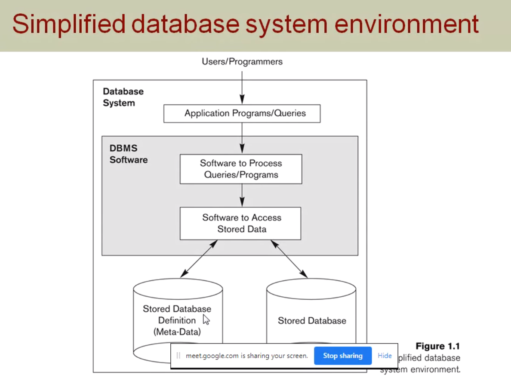
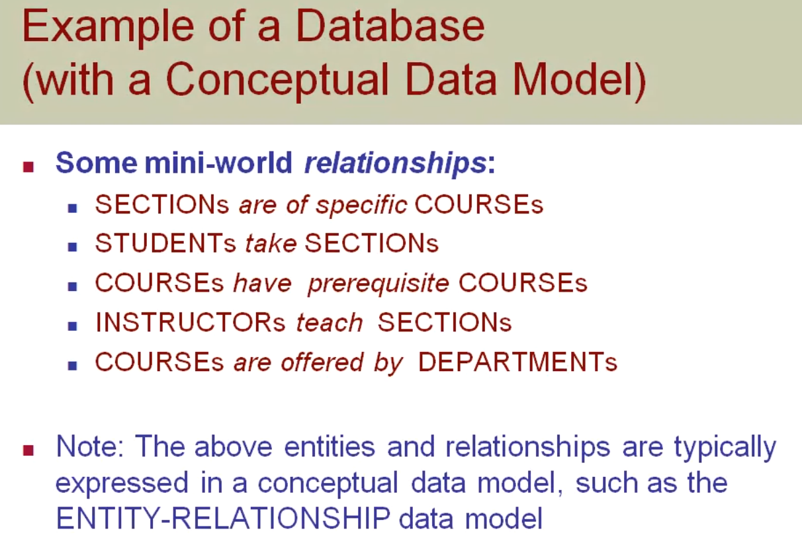

# Database management system(18CS53)

## Course object

- strong foundation in db concepts, tech and practice
- sql programming
- concurrency and transaction in db
- design and build a db app fro real world problems

## TBS:

- Fundamentals of db system ramez elmasri and shamkant B. Navathe 7th ed
- db mgmt sys ramakrishnan and gehrke 3rd edition

## Course outcome

- identify analyze and define db objects, enforce integrity constrains on db using rdbms
- use sql for db manipulation
- design and build simple db sys
- develop app to interact with db
- identify iimportance of normalization and concurrency

# Module 1

## Outline

- Types of db and db application
- basic defns
- dbms functionality
- ex of db(university)
- main characteristics of db appproach
- db users
- advantages of db approach over traditional file mgmt sys
- when not to use db

## Types of db and db application

### Traditional applications:

- Numeric and textual db

### More recent application:

- Multimedia db
- GEographic information system(GIS)
- Data warehouses
- Real-time and Active Db
- Many other application

## Basic defns

1. Database:- Is a collection of related data.
2. Data:- Known facts that can be recorded and have an implicit meaning.
3. Mini-worls:- Some part of the real world about which data is stored ina database. For ex, student grades and transcripts at a university
4. Database Management System(DBMS):- A sw pkg/sys to facilitate the creation and maintenance of a computerized db.
5. Database System:- The DBMS sw together with the data itself. Sometimes, the applications are also included.

## Simplified database system environment

## Typical DBMS Functionality

- Define a particular db in terms of its data types, structures, and contraints
- Construct or load the initial db contents on secondary storage medium
- Manipulate db (retrieval, modification, accessing db using web applications)
- Processing and sharing bya a set of concurrent users and application programs- yet, keeping all data valid and consistent
- Other features:

1.  Protection or security measures to prevent unauthorized access
2.  Presentation and visualization of data
3.  Maintaining the database and associated programs over the lifetime of the db application

## Properties of Database

- Database represents some aspects of the real world, called teh mini world or the universe of discourse.
- A database is a logically coherent collection of data with some inherent meaning
- Database is designed, built and populated with data for a specific purpose.

## Example of a Database(with a Conceptual data model)

### Mini world for the example:

- A part of a university environment

### Some mini-world entities:

- Students
- Courses
- Section (of Course)
- Departments
- Instructors

### Some mini world relationships

## Main characteristics of db approach

### Self-describing nature of db system:

- A Dbms catalog stores the description of a particular db(ex. data structures, types and constraints)
- The description is called meta-data.
- This allows the dbms sw to work with different db applications

## Insulation between programs and data:

- Called program-data independence.
- Allows changing data structures and storage organization without having to change the dbms access programs.

## Questions

- What is database and list their properties
