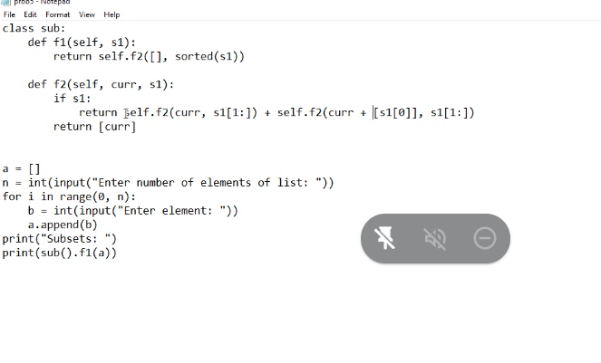

# calculator

```
class Calculator:
  def add(self, a, b):
    return a+b
  def sub(self, a, b):
    return a - b
  def mul(self, a, b):
    return a*b
  def div(self, a, b):
    return a/b;

calc = Calculator()
a = int(input())
b = int(input())

sum = calc.add(a, b)
diff = calc.sub(a, b)
prod = calc.mul(a, b)
div = calc.div(a, b)
```

```
class Acceptor:
  def __init__(self):
    a = input()

  def print(self):
    p = Printer(self.a)


clas Printer()
  def __init__(self, strin)
    print(strin)
```

```
import itertools
class Foo:
  def __init__(self, lst):
    self.lst = lst
    slef.op = []

  def getSubSets(self):
    for i in range len(self.lst):
      self.op.append(itertools.combinations(self.lst, i))
    return self.op

```



# Module 5(WebScraping)


# webbrowser py

```
import webbrowser
webbrowser.open('URL')

```

```
import webbrowser, sys, pyperclip

if len(sys.argv) > 1:
  address = ''.join(sys.argv[1:])
else:
  address = pyperclip.paste()

webbrowser.opn('https://www.google.co/maps/place/address'+ address)

```
