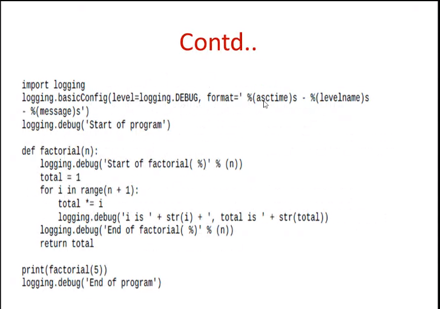
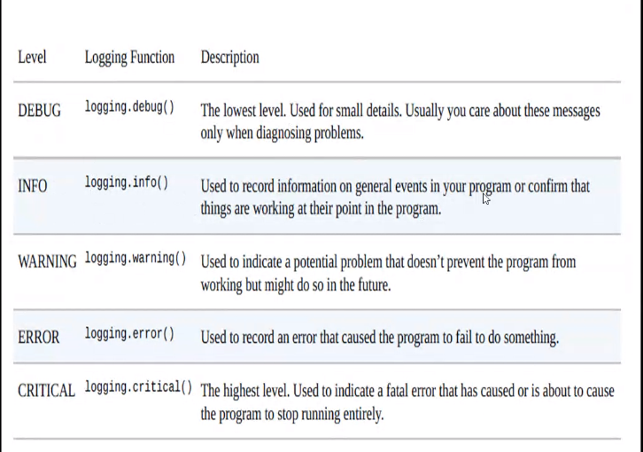

import traceback

traceback.format_exc() -> gives string of traceback

# Assertions

- assert keyword
- condition
- comma
- string when assertion gets to false

assert x == 5, 'Fk u x isn't 5 dumbass'

# logging

