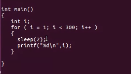
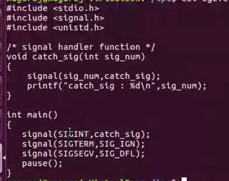
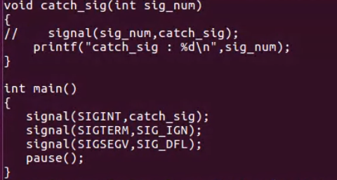
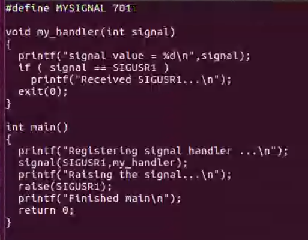
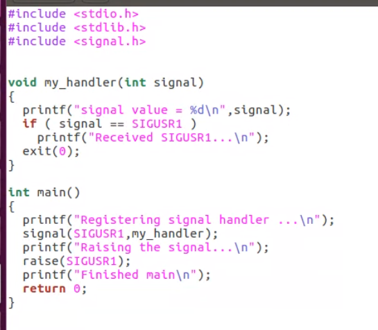

# Program to ehcoall command line arguments and env string

```
int main(int argc, char *argv[]){
    int i;
    char **ptr;
    extern char **environ;

    for(i = 0; i < argc, i++){
        printf("argv[%d] : %s\n", i, argv[i]);
    }

    for(ptr = environ; *ptr != 0; ptr++){
        printf("%s\n", *ptr);
    }

    exit(0);
}

```

# Signals(Mod 5)

- Signals are sw interrupts
- Two types hw and sw interrupts
- Signals provides a way of handling asych events.
- A user at a terminal typing the interrupt key to stop a program or the next program in a pipeline terminating permanently.

  - Examples of signals
    1. SIGABRT - abnormal termination - terminate
    2. SIGALRM - timer expired - terminate
    3. SIGSTOP - stop a process - stop process
    4. SIGCONT - continue a process - continue process
    5. SIGTERM - terminate a process - terminate
    6. SIGINT - terminal interrupt char - terminate
    7. SIGKILL - terminate - terminate

- When a signal is sent to a process, it is pending on the process to handle it.

- The process can react to pending signals in on of the 3 ways.
  1. Accept the default action of signal, which for most of the signal will terminate the process.
  2. Ignore the signal. The signal will be discarded and it has no affect whatsoever on the recepient process.
  3. Invoke a user defined function.The fn is known as signal handler routine and the signal is said to be caught this function is called.


```
ctrl + F -> to stop the process
ctrl + Q -> resume the process
ps -eal -> to list all processes
kill -STOP pid -> to stop stop with message
kill -CONT pid -> to resume
kill -SIGSTOP 5275 -> to stop without any message
kill -SIGCONT 5275 -> to resume
kill -9 pid -> permanent kill
```

# Unix kernel support to signals

- when a signal is generated for a process, the kernel will set the corresponding signal flag in the process table slot of the recepient process.
- If the recepient process is sleeping the kernel will awaken the process by scheduling it.
- When the recepient process runs the kernel will check tha process that contains the array of signal handling specification.
- The array will contain three different values 0, 1, any other action, 0 ->default, 1 -> ignore, other -> user defined action

- case 1:

  - if the array entry contains the 0 value the process will accept the default action of the signal

- case 2:

  - if the array entry contains the 1 value the process will ignore the signal and the kernel will discard it

- case 3:
  - if array entry contains any other value it is used as a function pointer for a user defined signal handler routine. it is used as the fn pointer for the user defined signal handler routine

```
#include<signal.h>

void (* signal(int sig_no, void(*handler)(int)))(int);

The formal argument of the api are
    sig_no is the signal identifier like SIGINT, SIGTER etc
    the handler argument is the fn pointer.
```

- The following ex attempts to

  1. to catch the SIGINTTERM signal
  2. ignores the SIGTERM signal
  3. accepts the default action of the SIGSEGV signal

- The pause() fn, suspends the calling process until it is interrupted by a signal and the corresponding signal handler does a return.





