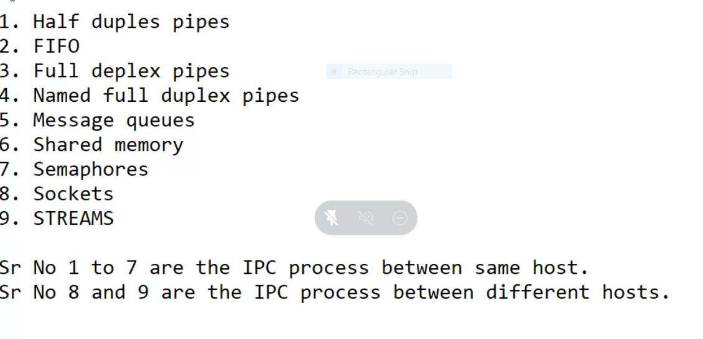
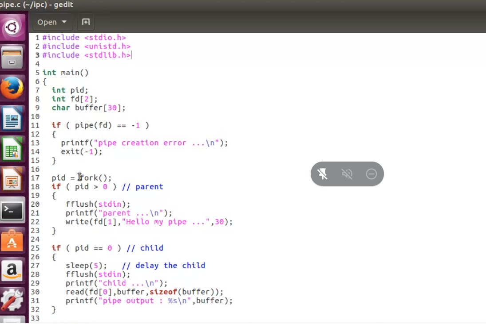
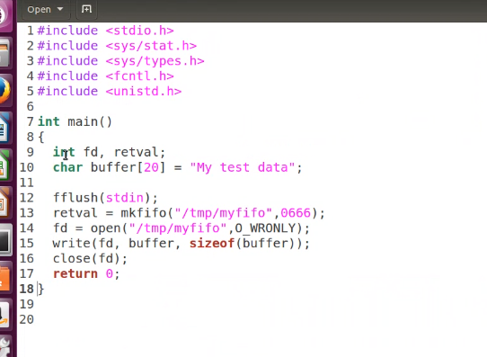
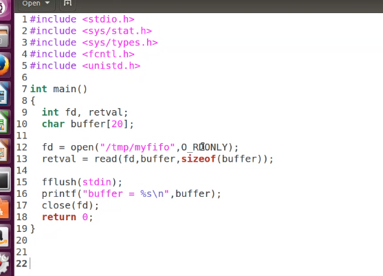

# Pipes

- ls -ls | wc

parent - child relationship

- pipe is used for child and parent process communication
- read() will return, how many bytes read
- write() will return, how many bytes written
- pipe is a unidirectional mechanism of IPC
- pipe is created by using a system call pipe()
- it returns 2 file descriptiors
- fd[0] - read end fd[1] - write end
- pipes have to be used with related processes
- they are un named


```
    return 0
}
```

# Fifo or named pipes

- Normal pipes are used for related processes(parent and child)
- It cannot be used to communicate between un related processes
- FIFO or named pipe is used for communication between two unrelated processes
- REading process will wait until the writing process writes



