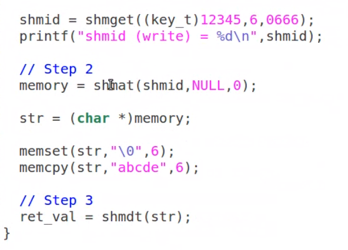
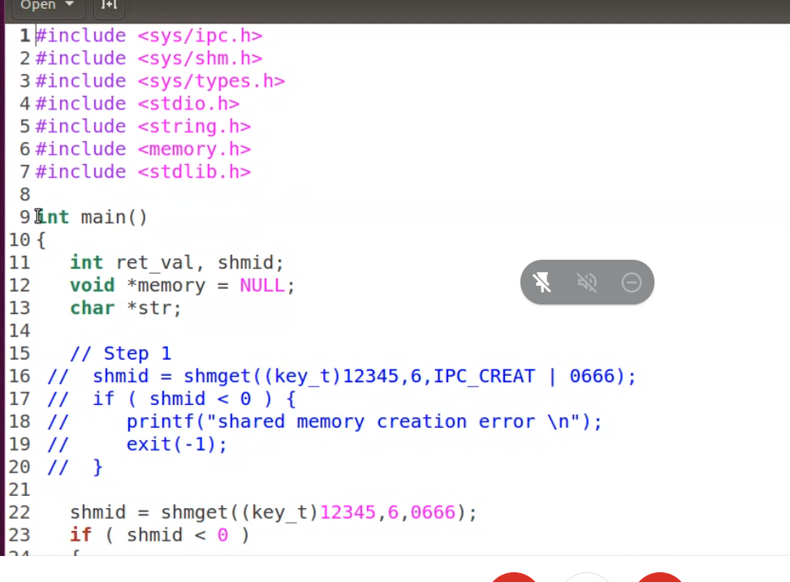
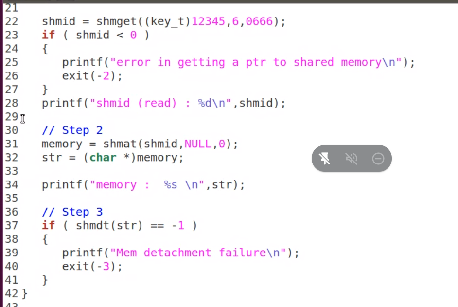

# Shared memory

- Interprocess communication using shared memory requires communicating processes to establish a region of shared memory
- Typically, a shared memory resides in the address space of the process creating the shared memory segment
- Other processes that wish to communicate using this shared memory segment must attach it to their address space
- Normally the OS tries to prevent one process from accessing another processes memory.
- Shared memory requires that 2 or more processes agree to remove this restriction.

- we have 3 steps in shared memeory:-
  1. shget()
  2. shmat()
  3. shmdt()

shm_write.c

shm read.c

