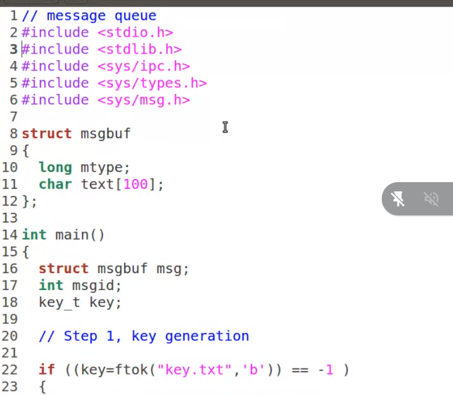
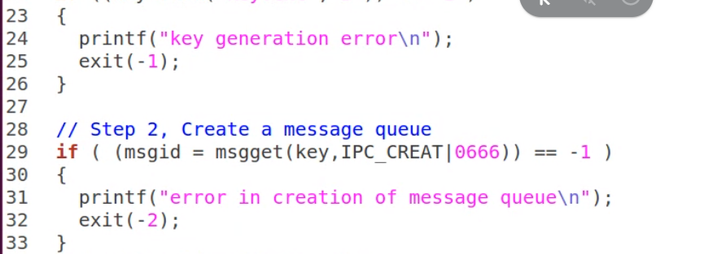
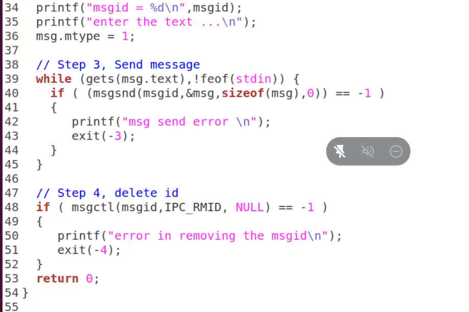
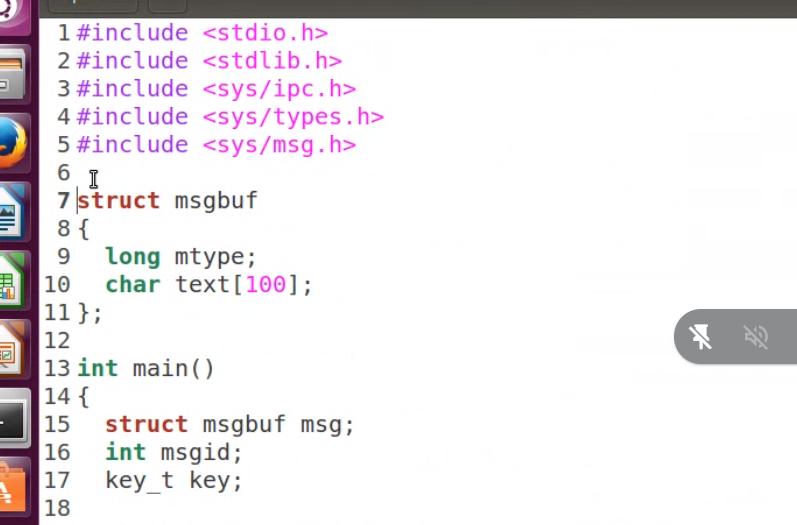
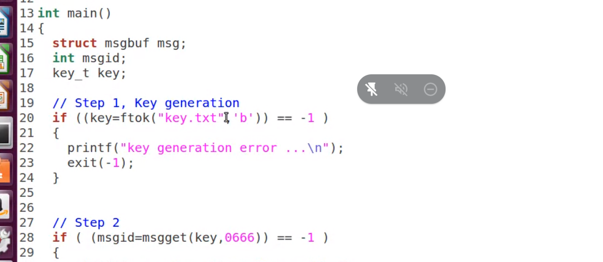
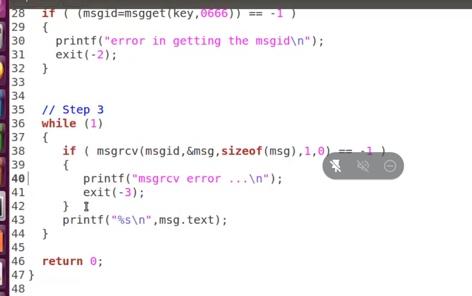
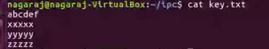

# Message Queue:

- message queue is a linked list in the kernel.
  msgget() - new queue is created / existing queue is opened.
  msgsnd() - write into the message queue.
  msgrcv() - Received from message queue.
  msgctl() - Perform control operations on message queues.

## msgsnd.c

## msgreceive.c

## key.txt

