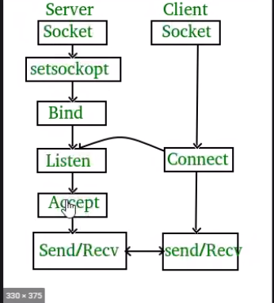

# tcp



# udp


# datastructures used in socket programming

```
used in internet prog and other programming
struct sockaddr {
    unsigned short sa_family; // IF_INET for internet
    char sa_data[14]; // IP_ADDR and port no

}

this structure is used only in internet programming
sturct sockaddr_in {
    short sin_family; // PF_INET
    unsigned short sin_port; // port no
    struct in_addr_sin_addr; // IP addr
    char sin_zero[8];       // padding
}


struct in_addr {
    unsigned long s_addr; //4 bytes long
}
```

# Byte ordering

- Big Endian format

  - Byte value
  - Memory

  ```
    OxAABB(Hex)
    BEF: OxAA OxBB
          [0]  [1]

  ```

- Little Endian format

  ```
  OxAABB(Hex)
    LEF: OxBB   OxAA
          [0]   [1]

  ```

```

int x = 0xAABBCCDD;

Big Endian
----------
Byte value 0xAA 0xBB 0xCC 0xDD
Memory       0   1    2    3

Little Endian
Byte value 0xDD 0xCC 0xBB 0xAA
Memor 0 1 2 3


```

- All network data is sent in Big Endian format

- In the field of networking it is called as network byte order and native byte representation on the host as host byte order.

- we have to convert all data into network byte order before transmission

# Utility functions

- Host byte order to network byte order.
  - Host to network short :-htons()
  - Host to network long:- htonl()
- Network byte order to host byte order
  - Netowrk to host short ntohs()
  - Network to host long ntohl()

# Ip address format

## ASCII dotted to binary:

- inet_aton()

## Binary to ASCII dotted.

- inet_ntoa()

# Socket

- socket()
- creates an end point for a network connection.
- int socket(int domain, int type, int protocol)
- use domain = PF_INET for internet
- type = SOCK_STREAM(tct), SOCK_DGRM(udp)
- protocol = 0

```
socket(PF_INET, SOCK_STREAM, 0)
will create a tcp socket and returns
a socket descriptor on success and -1 on the error.
```

# bind

- bind()
- attaches to an IP address and port no
- A server process calls bind to attach itself to a specific port and ip address.
- int bind(int socket_id, struct sock_address \*my_addr, socklen_t addrlen)
- socket_id -> id returned by socket system call
- my_addr -> it is a ptr to a valid sockaddr_in struct
- addrlen -> length of sockaddr_in struct

```
struct sockaddr_in my;
my.sin_family = PF_INET;
my.sin_port = htons(80);
my.sin_addr.s_addr = INADDR_ANY;
bzero(&my, 8);

bind(socket_id, (struct sockaddr *)&my, sizeof(my));
```

# listen

- listen()
- Waits for a connection request from the client
- The server process calls listen to tell the kernel to initialize a wait queue of connections for this socket_id.
- int listen(int socket_id, int backlog);
- socket_id: -> id returned by socket sys call
- backlog -> max length of the pending connection queue

```
listen(socket_id, 5)
This will allow a max of 5 connections to be in the pending state.


```

# accept

- accept()
- accepts new connection from the client
- accept is called by a server process to accept a new connection from new clients trying to connect to the server.
- int accept(int socket_id, (struct sockaddr \*)&client, socklen_t client_lenght)
- socket_id -> returned from socket()
- client -> will hold the new clients inf, ip addr and port no
- client_len -> size of client struct

```
struct sockaddr_in client;
int len = sizeof(client)

accept(sock_id, (struct aockaddr *)&client, &len)
```
