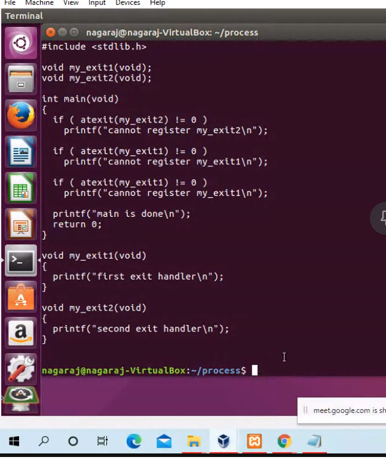
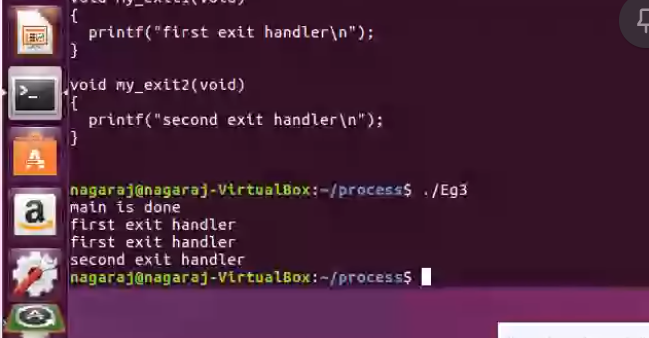

# Process

- A process is a program under execution in a UNIX or POSIX system.

# main function

- A c program starts execution with a function called main.
- The prototype of main fn is
  int main(int argc, char \*argv[])
  argc - no of command line args
  argv - array of pointers to the args
- when a c program is executed by the kernel, by one of the exec function a spcl start up routine is called before the main fn is executed.
- The executable program file specifies this routine as the starting address for the program.
- This startup routine takes values from the kernel, command line args and the environment and sets thing up so that the main function is called.

# Process Termination

- There are 8 ways for a process to terminate
  5 - normal terminations
  3 - abnormal terminations

- 5 - normal terminations
  1. Return from main
  2. Calling exit
  3. Calling \_exit or \_Exit
  4. return of the last thread from its start routine
  5. Calling pthread_exit from the last thread.
- 3 - abnormal terminations
  1. calling abort
  2. receipt of a signal
  3. response of the last thread to a cancellation request

# Exit funcitons

- \_exit \_Exit
  returns to the kernel immediately
- exit -> performs cleanup opertoins before returning to the kernel(closing the files, giving up of resources, freeing the memory)
- Exit -> immediately returns without cleaning up to the kernel

```
#include <stdlib.h>
void exit(int status);
void _Exit(int status);

#include <unistd.h>
void _exit(int status);


```

- returning an int value from the main fn is equivalent to calling exit with the same value.

```
main() {
    return(0);
    exit(0);
}
```

- In the following situtations the exit status of the process is undefined.
  1. any of these fns is called without an exit status.
     ex: - return, exit();

```
to find returned value of process
echo $?

```

# atexit fn

- with ISO C, a process can register upto 32 fns, that are automatically called by exit.
- these are called exit handlers and are registered by calling the atexit function.

```
#include<stdlib.h>
int atexit(void (*func)(void));
0- success
non zero - failure

we should pass the address of a fn as the argument to atexit.

```

- when this fn is called, it is not passed any args and is not expected to return a vlaue.
- the exit fn, calls these functions in the reverse order of their registration.
- fn1, fn2, fn3
- fn3, fn2, fn1
- each function is called as many times as it was registered.


- op


# setjmp and longjmp

- They let us save a specific point during execution and let us return to the point later.

- It is like a bookmar.
  setjmp -> placing a boomark.
  longjmp -> going towards a bookmark.

```
setjmp(env), longjmp(env, t)

jmp_buf env;
jmp_buf is the bookmark.
It saves
  - our position  in the code - PC(program counter)
  - our posiiton in the stack. (Stack pointer)
- setjmp overwrites env variable with the current value of PC and SP
- longjmp replaces our PC and SP with the values saved in the environment
- It jumps to those position in the code

```

# what is the return value of setjmp and longjmp ?

- longjmp does not return any value because it jumps to another point in code
- setjmp returns twice.
  - 1st time is when we save our PC and SP to env variable returns 0
  - 2nd time is when we jump back to setjmp from longjmp(env, t)
    Here it returns t which is a parameter for longjmp
- Imp: make it not equal to zero. So that you can distinguish between 2 returns
  
- op
  
